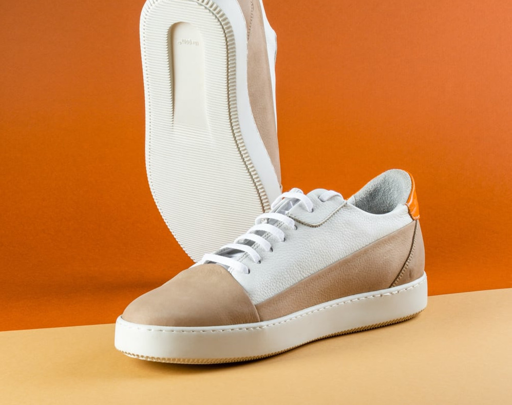

# Frontend Mentor - E-commerce product page solution

This is a solution to the [E-commerce product page challenge on Frontend Mentor](https://www.frontendmentor.io/challenges/ecommerce-product-page-UPsZ9MJp6). Frontend Mentor challenges help you improve your coding skills by building realistic projects.

## Table of contents

- [Overview](#overview)
  - [The challenge](#the-challenge)
  - [Screenshot](#screenshot)
  - [Links](#links)
- [My process](#my-process)
  - [Built with](#built-with)
  - [What I learned](#what-i-learned)
  - [Continued development](#continued-development)
  - [Useful resources](#useful-resources)
- [Author](#author)


## Overview

### The challenge

Users should be able to:

- View the optimal layout for the site depending on their device's screen size
- See hover states for all interactive elements on the page
- Open a lightbox gallery by clicking on the large product image
- Switch the large product image by clicking on the small thumbnail images
- Add items to the cart
- View the cart and remove items from it

### Screenshot


### Links

- Solution URL: [https://github.com/carolmedici/e-commerce-product-page](https://github.com/carolmedici/e-commerce-product-page)
- Live Site URL: [Add live site URL here](https://your-live-site-url.com)

## My process

### Built with

- Semantic HTML5 
- CSS custom properties
- Flexbox
- CSS Grid
- Mobile-first workflow
- JS 


### What I learned

I learned how to make a slideshow and a lightbox with HTML, CSS and JS.


```html
<!-- Slideshow mobile -->
<div id="slide-mobile">
    <div class="slideshow-container">
    
        <!-- Full-width images with number and caption text -->
        <div class="mymobileSlides fade">
           
        </div>
    
        <div class="mymobileSlides fade">
          
         </div>
    
        <div class="mymobileSlides fade">
          
        </div>
    
        <div class="mymobileSlides fade">
            
    
          </div>
    
        <!-- Next and previous buttons -->
        <a class="prevmobile" onclick="plusSlidesmobile(-1)">&#10094;</a>
        <a class="nextmobile" onclick="plusSlidesmobile(1)">&#10095;</a>
      </div>
      <br>
```
```css
/* Slideshow container */
.slideshow-container {
  max-width: 1000px;
  position: relative;
  margin: auto;
 
}

/* Hide the images by default */
.mymobileSlides {
  display: none;
  z-index:-1 ;
}


/* Next & previous buttons */
.prevmobile, .nextmobile {
  cursor: pointer;
  position: absolute;
  top: 50%;
  width: auto;
  margin-top: -22px;
  padding: 16px;
  color: white;
  font-weight: bold;
  font-size: 18px;
  transition: 0.6s ease;
  border-radius: 0 3px 3px 0;
  user-select: none;
}
```
```js
let slideIndexmobile = 1;
mobileSlides(slideIndexmobile);

// Next/previous controls
function plusSlidesmobile(n) {
  mobileSlides(slideIndexmobile += n);
}

// Thumbnail image controls
function currentSlide(n) {
  mobileSlides(slideIndexmobile = n);
}

function mobileSlides(n) {
  let i;
  let slides = document.getElementsByClassName("mymobileSlides");
 
  if (n > slides.length) {slideIndexmobile = 1}
  if (n < 1) {slideIndexmobile = slides.length}
  for (i = 0; i < slides.length; i++) {
    slides[i].style.display = "none";
  }
  
  slides[slideIndexmobile-1].style.display = "block";
  dots[slideIndexmobile-1].className += " active";
}
```


### Continued development

In the next projects I will continue focusing on actions performed with JS, such as making a responsive shopping cart, using modal, slideshow, to continue improving my skills and my codes.

### Useful resources

- [How TO - Slideshow - W3Schools](https://www.w3schools.com/howto/howto_js_slideshow.asp) - 
This site helped me understand how to make a slideshow.
- [Criando um slideshow com Javascript puro - MXCursos](https://www.mxcursos.com/blog/criando-um-slideshow-com-javascript-puro/) - This site also helped me understand how to make a slideshow.


## Author

- LinkedIn - [Carolina Médici](https://www.linkedin.com/in/carolina-medici/)
- Frontend Mentor - [@carolmedici](https://www.frontendmentor.io/profile/carolmedici)


## Note
This project still in development.
